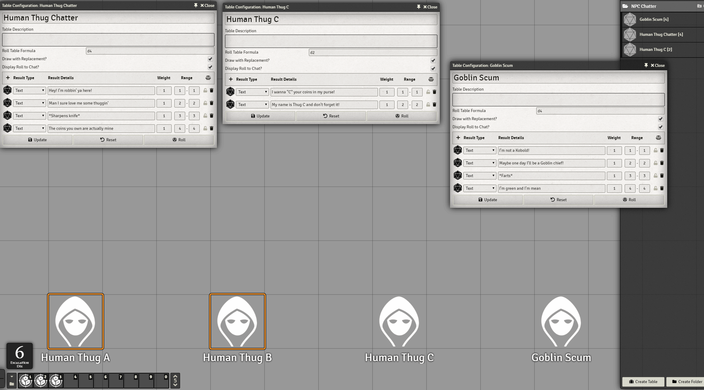
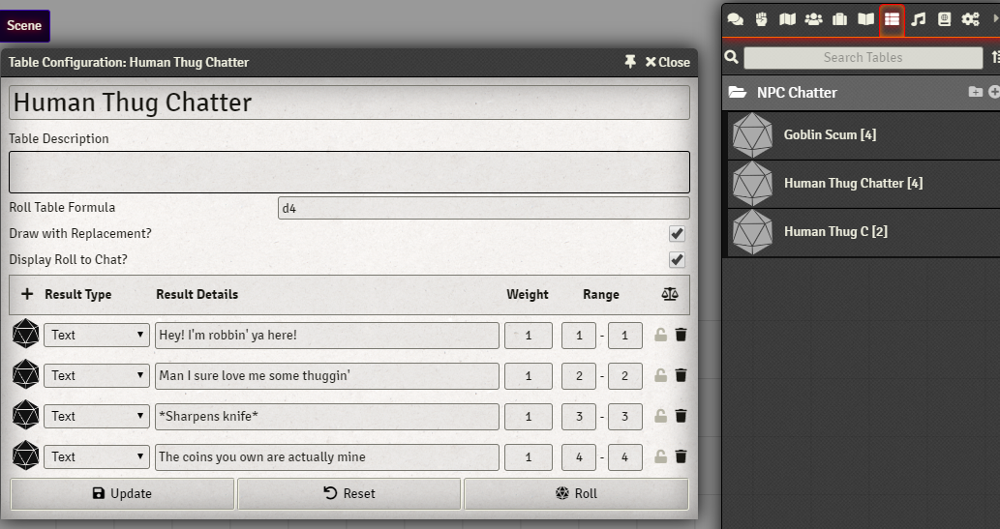

[](https://github.com/cswendrowski/foundryget)
[](https://www.buymeacoffee.com/T2tZvWJ)


# NPC Chatter

Your NPCs have things to say.
This Module provides a small API that allows your NPCs to randomly chatter off of roll tables defined for them.

Chatter is displayed as ChatBubbles only, and won't dump to the Chat Log.

I recommend you turn off the Core "Pan to Token Speaker" setting or else risk whiplash.



# Installation

## FoundryGet

Using [FoundryGet](https://github.com/cswendrowski/foundryget)

```
foundryget install https://raw.githubusercontent.com/cswendrowski/FoundryVtt-Npc-Chatter/master/module.json
```

## Foundry


# Setup

Given a set of Villagers named "Villager A", "Villager B", and "Villager C", setup a "Villager Chatter" roll table or a "Villager" table under a Folder named "NPC Chatter".

This roll table will need at least one option and a dice roll configured to work.

If "Villager A" has specific dialogue that might trigger on top of the generic Villager chatter, add another "Villager A Chatter" table (or "Villager A" in the "NPC Chatter folder) and it will draw from that as well.



# Usage

Chatter can only be triggered via scripting. There are a few Macros included as examples - most work out of the box, but some require additional setup.

The easiest macro is the "Timed Global Chatter" macro - just slap it when a Scene Loads, and they will start chattering!

## Trigger Happy

[Trigger Happy](https://github.com/kakaroto/fvtt-module-trigger-happy) can trigger NPC chatter as well. Here's an example to get you started:

When an Actor walks into a Room (defined by an invisible actor), have a specific Token chatter: `@Actor[TriggerA] @Macro[OXyjmVhEGo3eTaJz]{Specific Token Chatter}`

# API

## Global Chatter

Picks a random Chatter Table belonging to a random Actor on the first active Scene and displays a ChatBubble with rolled Text off of the random Chatter Table.

```js
async globalChatter()
```

## Global Chatter Every Interval

Every interval as measured in milliseconds, executes `globalChatter()`.

```js
randomGlobalChatterEvery(milliseconds)
```


## Disable Global Chatter

Clears out the timer on `randomGlobalChatterEvery`

```js
turnOffGlobalTimerChatter()
```

## Token Chatter

Given a `Token`, tries to find a matching Chatter Table. If none, exits. If one or more, randomly picks one and displays a rolled result from it as a ChatBubble.

```js
async tokenChatter(token)
```

## Selected Chatter

Grabs the currently selected Tokens and tries to find matching Chatter Tables. If none, exits. If one or more, randomly picks one and an eligible Token and displays a rolled result from the Table as a ChatBubble.

```js
  async selectedChatter()
```
